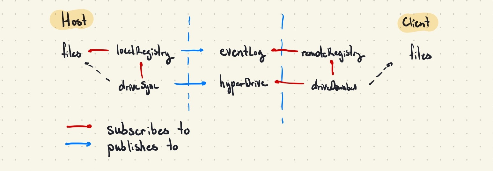

# portal
Zero-config peer-to-peer encrypted live folder syncing tool that respects your `.gitignore`. Not the 2007 video game.

Built on top of the [Hypercore protocol](https://hypercore-protocol.org/) with emphasis on being zero-config, secure, and decentralized.

## Demos
<p align="center">
  
  
</p>

## Installation
```shell
# Requires node >=v12.22.1
$ npm i -g portal-sync

# Start using portal
$ portal new

# or 
$ portal join [sessionID]
```

## Highlights
* **Ephemeral**: As soon as you close your `portal`, no further content can be downloaded from it. No data is stored anywhere except on the host device.
* **Decentralized**: There is no central `portal` server that all data is routed through. `portal` only uses public servers to maintain a DHT (distributed hash table) for peer discovery.
* **One-to-many**: A single host can sync data to any number of connected peers.
* **Stream-based**: Utilizes file streaming to handle files of arbitrary size (regardless of whether they fit in memory or not)
* **Efficient**: Changes in single files means that only one file needs to be synced. `portal` tracks which files have changed to avoid resyncing entire folders wherever possible.
* **Secure**: Like Dat, all data is encrypted using the read key. Only those that possess your current 32-byte `portal` session ID can view the data you share.


## Architecture


### Publish-subscribe Model
Portal relies on a publish-subscribe event model to drive its render and update cycles. File tree structure and individual file statuses are stored in a trie structure known as the Registry. On the host side, there is a local Registry that listens to file changes on the host machine and broadcasts them to an append-only [Hypercore](https://hypercore-protocol.org/protocol/#hypercore) that is used as an event log. A drive syncing hook listens for changes in the local registry and streams file changes from disk to a [Hyperdrive](https://hypercore-protocol.org/protocol/#hyperdrive). On the client side, a remote Registry listens for changes in the event log and replicates changes locally. A drive download hook listens for changes in the remote registry and streams file changes from the Hyperdrive to the local disk.

### Connection
Portals are identified by unique* 32-byte keys. When a client 'joins' a portal, `portal` looks up the session key using [Hyperswarm](https://hypercore-protocol.org/protocol/#hyperswarm) and establishes a connection to the host using UDP holepunching.

*8.63x10<sup>-78</sup> chance of collision

### How is this different from Dat?
Might seem similar to another similar project built on top of the Hypercore protocol called [Dat](https://github.com/datproject/dat) but there are a few key differences.
1. Dat relies on nodes to keep seeding archives and drives and aims to be a distributed filesystem whereas `portal` focuses purely on being one-to-many for file sharing/syncing.
2. No footprint. Because `portal` is designed to be zero-config, it doesn't leave any dotfiles laying around, whereas Dat stores secrets and metadata in a `~/.dat` folder.
3. Dat tracks version history. Although `portal` runs on the same underlying protocols, I haven't found a need to utilize version histories yet.
4. `portal` respects your `.gitignore` so it doesn't sync anything you don't want (like pesky `node_modules`)

## Developing
1. Clone the repository and ensure you have `node >= v12.22.1`
2. Run `yarn` to install deps and `yarn dev` to enable hot-reload
3. Run `yarn link` to register `portal` as a valid executable